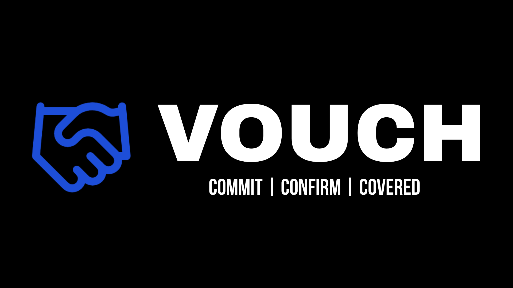

<div align="center">
  

  <br />
  <br />

  <h3>Commitment-backed payments for real-world agreements.</h3>

  <p>
    Create a Vouch. The other party accepts. Both confirm presence.<br />
    Funds release. Otherwise, refund, void, or non-capture.
  </p>

  <p>
    <a href="#how-it-works">How it works</a>
    ·
    <a href="#built-for-real-life">Built for real life</a>
    ·
    <a href="#the-rule">The rule</a>
    ·
    <a href="#what-vouch-is-not">Boundaries</a>
    ·
    <a href="#license">License</a>
  </p>

  <p>
    
    
    
    
    
  </p>

  <p>
    
    
    
    
    
    
    
    
    
    
  </p>
</div>


# Vouch

**Vouch is a commitment-backed payment coordination system for appointments and in-person agreements.**

It is built around one simple rule:

> **Both parties confirm presence within the confirmation window → funds release.**  
> **Otherwise → refund, void, or non-capture.**

No marketplace.  
No ratings.  
No dispute court.  
No public provider directory.  
No “who was right?” workflow.

Just commitment, confirmation, and a deterministic payment outcome.

---

## Commit. Confirm. Covered.

Real-world agreements fall apart when commitment is cheap.

People miss appointments.  
Clients ghost service providers.  
Meetups lose trust.  
Time gets wasted.  
Nobody wants to turn every agreement into a marketplace, arbitration case, or endless message thread.

Vouch adds a clear payment-backed commitment layer around an agreement both people already made.

```txt
CREATE → ACCEPT → CONFIRM → RELEASE
```

If both people confirm presence, funds release.

If confirmation does not complete, funds do not release.

---

## How it works

### 1. Create

One party creates a Vouch, sets the amount, and defines the confirmation window.

### 2. Accept

The other party reviews and accepts the Vouch.

### 3. Confirm

Both parties confirm presence within the confirmation window.

### 4. Release

If both confirmations happen in time, funds release through the payment provider.

If confirmation does not complete, the payment is refunded, voided, or not captured according to provider state.

---

## Built for real life

Vouch is designed for agreements that happen outside the app.

| Use case              | Where Vouch fits                                                                   |
| --------------------- | ---------------------------------------------------------------------------------- |
| **Appointments**      | Medical, wellness, legal, financial, and other important appointments              |
| **Meetups**           | In-person meetings where commitment and trust matter                               |
| **Services**          | One-time services, specialized work, consultations, and local jobs                 |
| **Custom agreements** | Any real-world arrangement where both parties benefit from a clear commitment rule |

---


---

## The rule

Vouch does not judge disputes.

Vouch does not decide who was right.

Vouch does not manually award funds.

Vouch follows the confirmation rule.

| Confirmation outcome         | Payment outcome              |
| ---------------------------- | ---------------------------- |
| Both parties confirm in time | Funds release                |
| Only one party confirms      | Funds do not release         |
| Neither party confirms       | Funds do not release         |
| Confirmation window expires  | Refund, void, or non-capture |

One-sided confirmation never releases funds.

---

## Pricing

Vouch is designed to be clear before commitment.

* **Platform fee:** 5%
* **Minimum platform fee:** $5
* **Payment processing:** provider fee
* **Release rule:** both confirm

Fees are shown before payment commitment.

---

## Payment coordination, not custody

Vouch coordinates payment state through provider-backed infrastructure such as Stripe and Stripe Connect.

Vouch does not directly custody funds.

Vouch does not store raw card data, raw bank data, raw identity documents, or unnecessary payment-provider payloads.

Vouch stores operational records needed to coordinate the lifecycle:

* statuses
* provider references
* timestamps
* confirmation state
* readiness state
* audit-safe metadata

---

## What Vouch is not

Vouch is intentionally narrow.

It is not:

* a marketplace
* a booking marketplace
* a discovery platform
* a scheduler
* a messaging app
* a social platform
* a review system
* a rating system
* a reputation network
* a dispute-resolution platform
* an escrow provider
* a broker
* an arbitration service

Vouch does not provide public provider profiles, public client profiles, service listings, search, categories, recommendations, featured providers, ratings, reviews, reputation scores, or dispute workflows.

---

## Design language

Vouch uses a brutalist product interface built around clarity and confidence.

* black-first surfaces
* Vouch blue: `#1D4ED8`
* hard borders
* condensed display typography
* translucent black cards
* deterministic copy
* minimal distractions
* consistent CTA behavior

The interface is designed to make the rule obvious:

> **Commit. Confirm. Covered.**

---

## Status

Vouch is in active development.

The public repository exists to build the product openly while preserving the product’s narrow operating boundaries.

---

## License

MIT License.

Made in Nuevo Mexico | 2026 Ivan P. Roman | Digital Herencia

